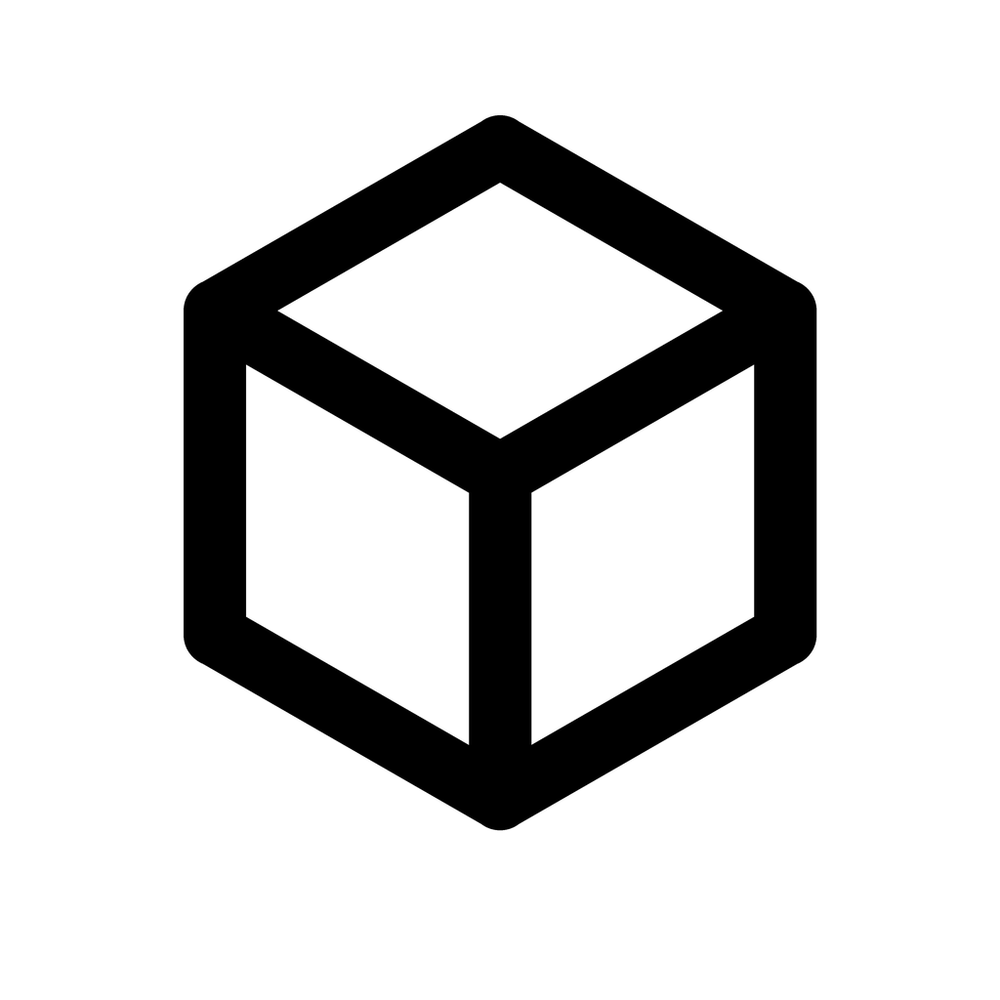

<p align="center">
  
</p>

# 小白盒

> **当前状态：公开测试版（Beta）**
>
> 小白盒仍在持续开发和更新中，界面、工程格式和部分功能可能继续调整。建议重要工程保留独立备份，并通过 Issues 反馈问题和建议。

面向零基础创作者的 Windows 离线桌面工具。它用积木式摆放、画布点线面建模、简化人台、摄影机和时间轴，帮助用户快速表达空间、构图、运镜与物体动作，再导出到 AI 图像/视频平台或常用三维软件。

小白盒的初衷很朴素：很多创作者知道自己想要什么画面，却很难只靠文字准确说清空间、镜头、人物站位和运动过程；专业三维软件又常常把新手挡在门外。小白盒想补上中间这一步，让更多普通人先把“空间和动作草稿”搭出来，再带到 AI 创作平台或其他三维软件继续完善。

它不是缩小版 Blender，而是一款专注于“快速搭建、快速表达、方便导出”的大众化建模工具。

当前测试版不接入 AI、不要求账号、不包含广告或遥测，也不会上传工程、模型、图片和视频；核心建模、保存和导出流程均可离线使用。

## 软件特点

- **零基础友好**：主流程只突出添加、摆放、镜头、动画和导出，尽量使用普通语言代替专业术语。
- **快速搭建场景**：提供基础体、墙体、地面、自定义点线面建模和统一白模人台。
- **直观调整镜头与动作**：支持独立摄影机、实时取景、简化时间轴、物体动画和人台姿势。
- **多用途导出**：支持图片、视频、三维模型及深度、轮廓、法线、对象色块和遮罩等控制素材。
- **本地与隐私优先**：工程和素材保存在用户电脑中，不要求账号，不上传用户数据。
- **开源并持续更新**：项目采用 MIT License，欢迎提交 Issue、功能建议和代码改进。

## 已可使用

- 添加方块、圆柱、球体、墙体、地面和可直接拖动四肢端点的统一白模人台。
- 框选多个物体，整体移动、旋转、缩放、对齐、等距排列和落地。
- 在画布中落点、连线、闭合成面、沿面法线拉伸、移动/焊接顶点和有限平面切割。
- 导入 GLB、GLTF、OBJ/MTL；原始模型始终保留，可选择可逆轻量预览。
- 设置摄影机画幅、实时取景窗、灯光和简化时间轴。
- 导出 PNG、六类像素对齐控制图、PNG 动画帧、MP4/H.264、GLB、GLTF 和 OBJ。
- 通过 `.block3d` 本地工程保存、另存为、自动恢复和最近工程继续编辑。

## 获取与使用

普通用户可从 [GitHub Releases 最新版本](https://github.com/Amyliya-bot/xiaobaihe/releases/latest) 下载 `xiaobaihe-<版本>-setup.exe`。安装后直接启动，不需要安装开发环境、登录账号或保持联网。

1. 从左侧添加基础体、人台，或导入已有模型。
2. 使用画布控制柄完成摆放和形状调整。
3. 调整主摄影机，在时间轴记录镜头与物体状态。
4. 先保存 `.block3d` 工程，再从顶部选择图片、视频或模型导出。

完整操作说明见 [用户使用指南](docs/用户使用指南.md)。平台预设记录核对日期，但上传前仍应查看目标平台当日规则。

## 开源源码

仓库只包含公开运行和继续开发所需的源码、测试、构建脚本、许可证、用户说明和项目介绍；内部访谈记录、开发流程、阶段状态、验证草稿和本地发布缓存不作为公开源码发布。

需要 Node.js 22.12 或更高版本和 Windows：

```powershell
cd app
npm install
npm run verify
npm run test:e2e
npm run build:win
```

技术基线为 Electron、React、TypeScript 和 Three.js。渲染进程启用隔离与沙箱，文件操作只通过类型化 preload API 进入主进程。

## 发布边界

- 当前定位是空间、镜头与动作草稿工具，不替代 Blender，也不包含雕刻、任意布尔、专业材质或视频剪辑。
- MP4 使用 Electron Chromium 的 WebCodecs 能力；不支持的设备会明确建议改用 PNG 帧。
- 第三方模型来源复杂，固定验证样本不能代表所有 GLTF/OBJ 变体均兼容。
- 首个公开 Beta 建议同时提供 SHA-256 校验值；未配置商业代码签名证书时，Windows 可能显示信誉提醒。

隐私说明见 [PRIVACY.md](PRIVACY.md)，版本变化见 [CHANGELOG.md](CHANGELOG.md)，贡献方式见 [CONTRIBUTING.md](CONTRIBUTING.md)。

本项目采用 [MIT License](LICENSE)。第三方组件继续遵循各自许可证，发行包内附完整运行时许可文本和构建依赖清单。
